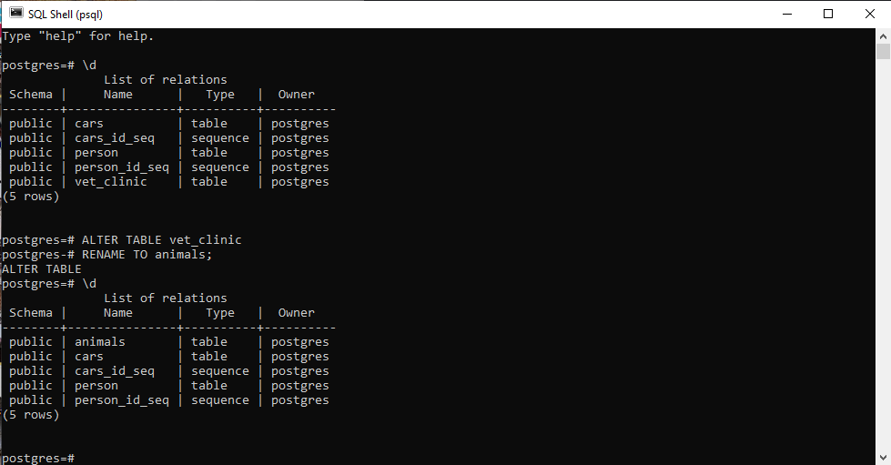
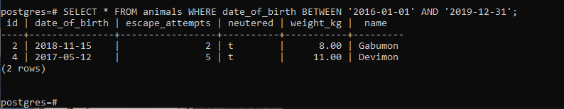
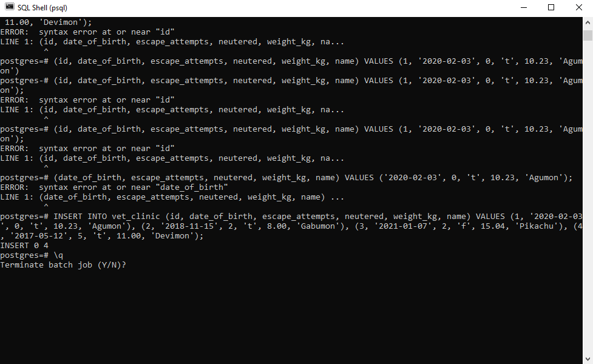
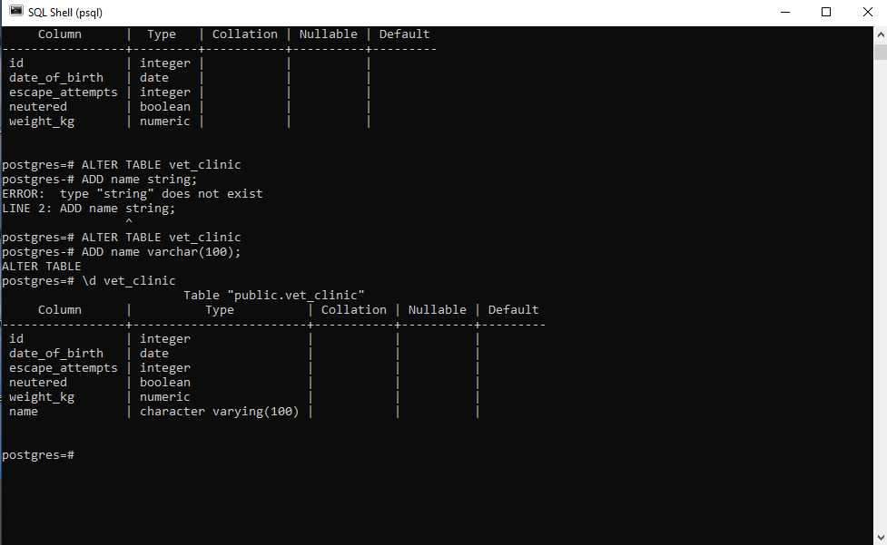
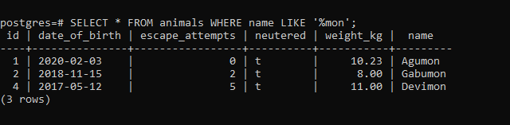
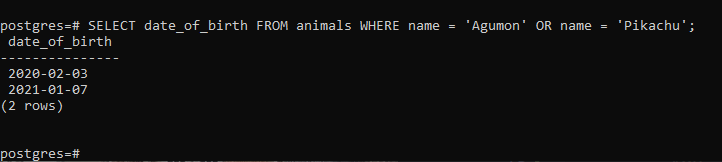
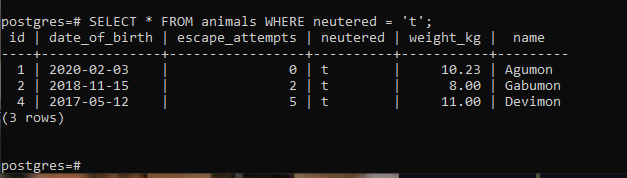
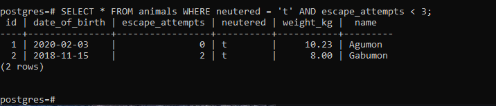
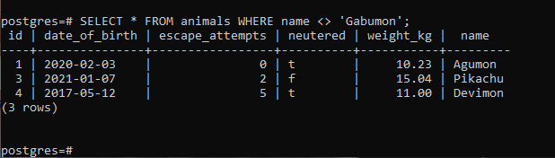

## I altered table name and added renmaed the table because forgot to use the correct name initially.

  

## List the name of all animals born between 2016 and 2019.

  

## Created the table (check the following image to understand the name that is not there)

  

## I altered table name and added name because i forgot to add it initially

  

## Find all animals whose name ends in "mon".

  

## List the date of birth of all animals named either "Agumon" or "Pikachu".

  

## Find all animals that are neutered.

  

## List the name of all animals that are neutered and have less than 3 escape attempts.

  

## Find all animals not named Gabumon.

  

