## Add a column species of type string to your animals table. Modify your schema.sql file.

  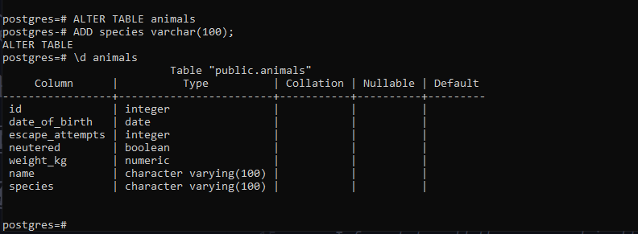

-- Insert the following data:
-- Animal: His name is Charmander. He was born on Feb 8th, 2020, and currently weighs -11kg. He is not neutered and he has never tried to escape.
-- Animal: Her name is Plantmon. She was born on Nov 15th, 2021, and currently weighs -5.7kg. She is neutered and she has tried to escape 2 times.
-- Animal: His name is Squirtle. He was born on Apr 2nd, 1993, and currently weighs -12.13kg. He was not neutered and he has tried to escape 3 times.
-- Animal: His name is Angemon. He was born on Jun 12th, 2005, and currently weighs -45kg. He is neutered and he has tried to escape once.
-- Animal: His name is Boarmon. He was born on Jun 7th, 2005, and currently weighs 20.4kg. He is neutered and he has tried to escape 7 times.
-- Animal: Her name is Blossom. She was born on Oct 13th, 1998, and currently weighs 17kg. She is neutered and she has tried to escape 3 times.
-- Animal: His name is Ditto. He was born on May 14th, 2022, and currently weighs 22kg. He is neutered and he has tried to escape 4 times.

  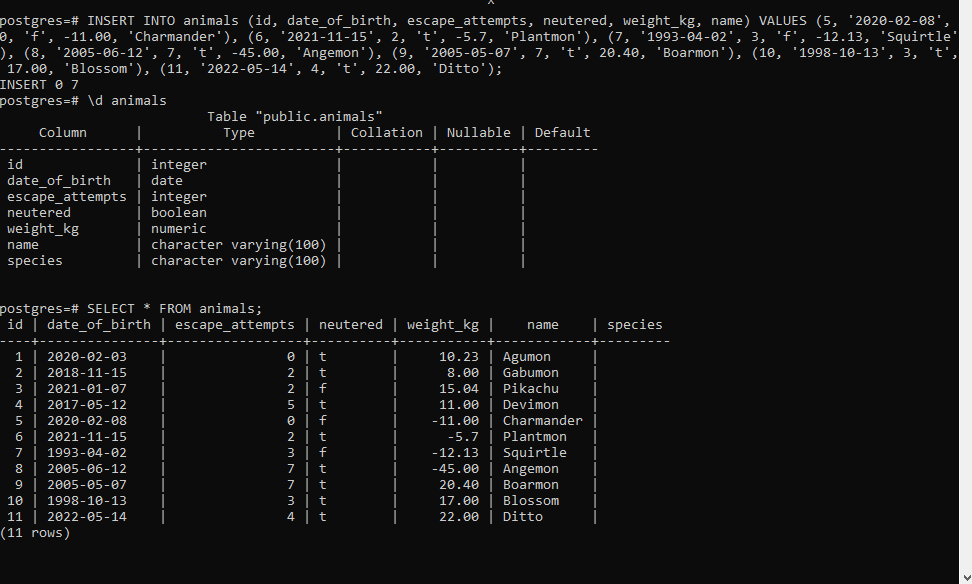

## Inside a transaction update the animals table by setting the species column to unspecified. Verify that change was made. Then roll back the change and verify that the species columns went back to the state before the transaction.

  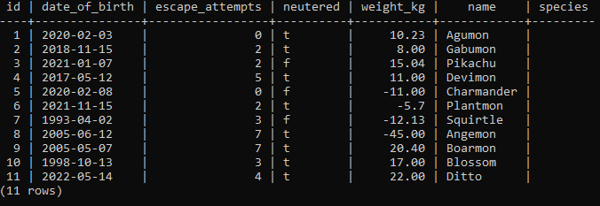

  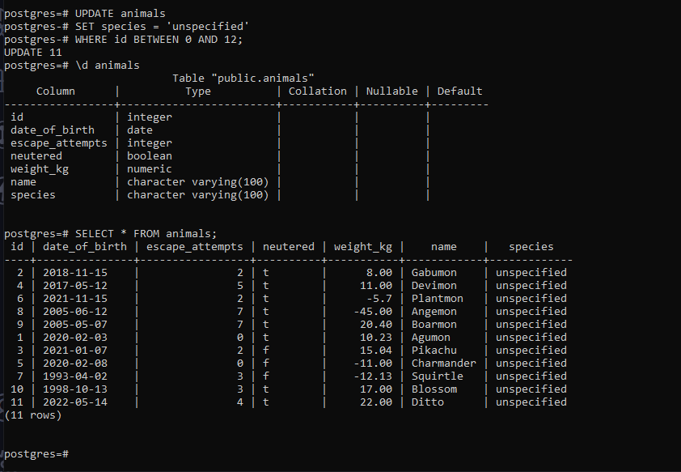

## Inside a transaction: Update the animals table by setting the species column to digimon for all animals that have a name ending in mon. Update the animals table by setting the species column to pokemon for all animals that don't have species already set. Commit the transaction. Verify that change was made and persists after commit.

  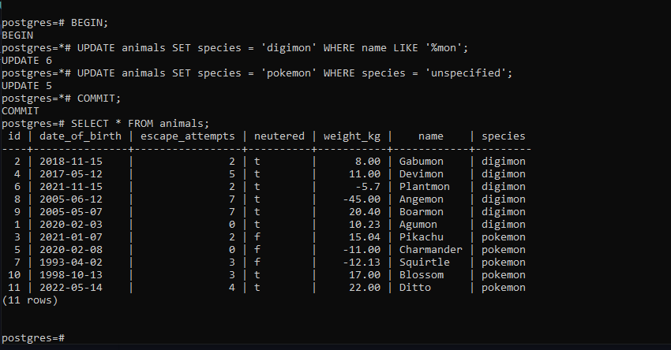

## Now, take a deep breath and... Inside a transaction delete all records in the animals table, then roll back the transaction. After the rollback verify if all records in the animals table still exists. After that, you can start breathing as usual.

  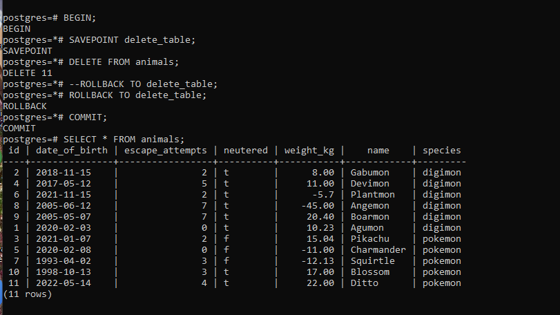

## Inside a transaction: Delete all animals born after Jan 1st, 2022. Create a savepoint for the transaction. Update all animals' weight to be their weight multiplied by -1. Rollback to the savepoint Update all animals' weights that are negative to be their weight multiplied by -1. Commit transaction

  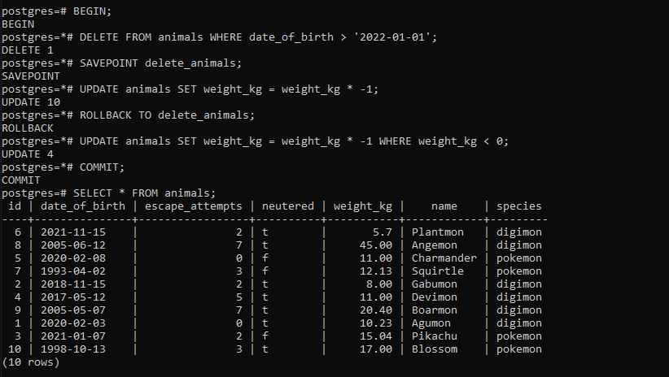

## How many animals are there?

  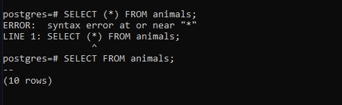

## How many animals have never tried to escape?

  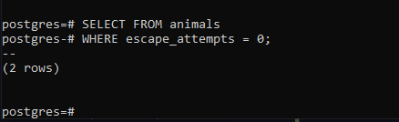

## What is the average weight of animals?

  

## Who escapes the most, neutered or not neutered animals?

  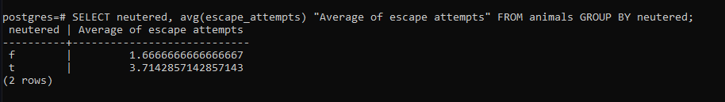

## What is the minimum and maximum weight of each type of animal?

  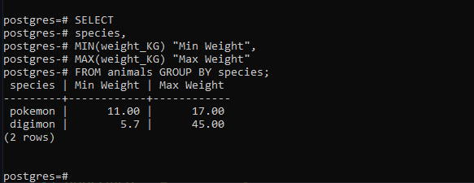

## What is the average number of escape attempts per animal type of those born between 1990 and 2000?

  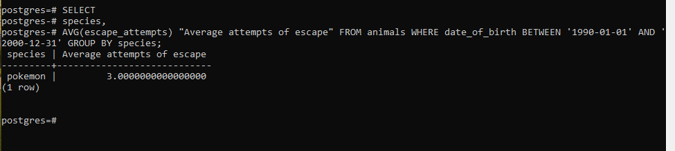

