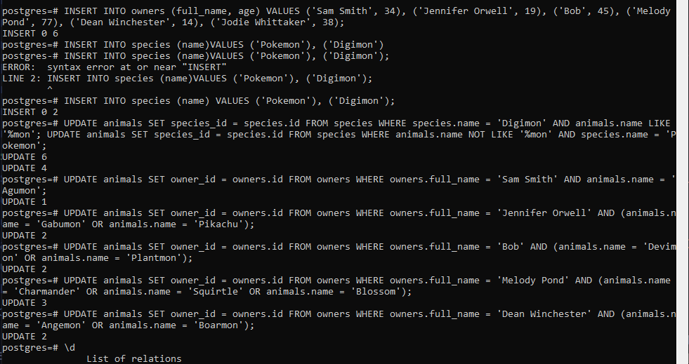
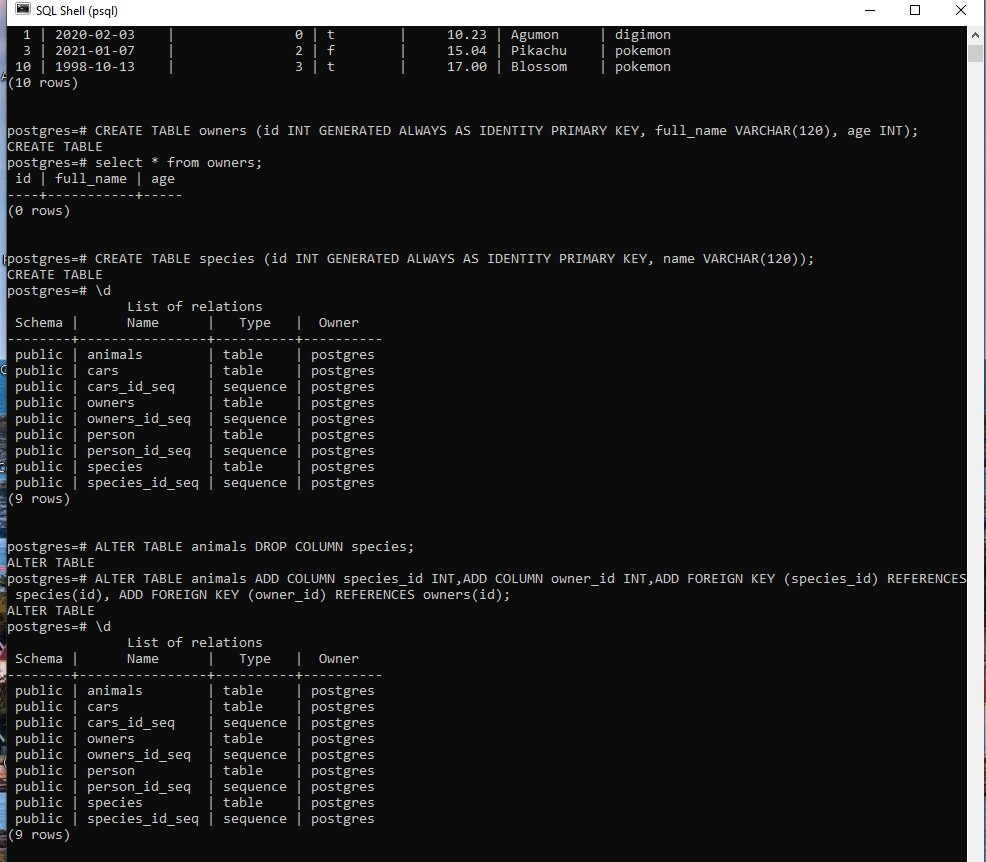
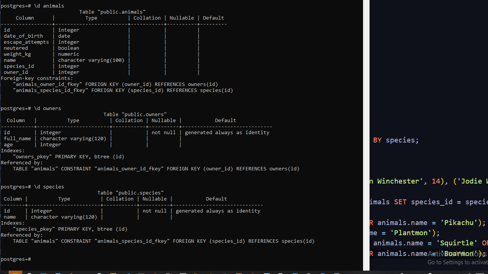
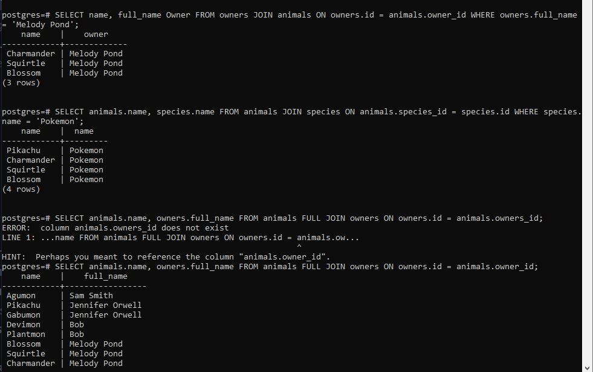
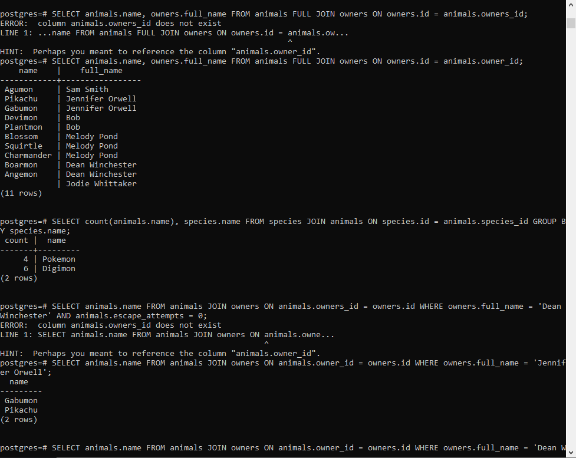
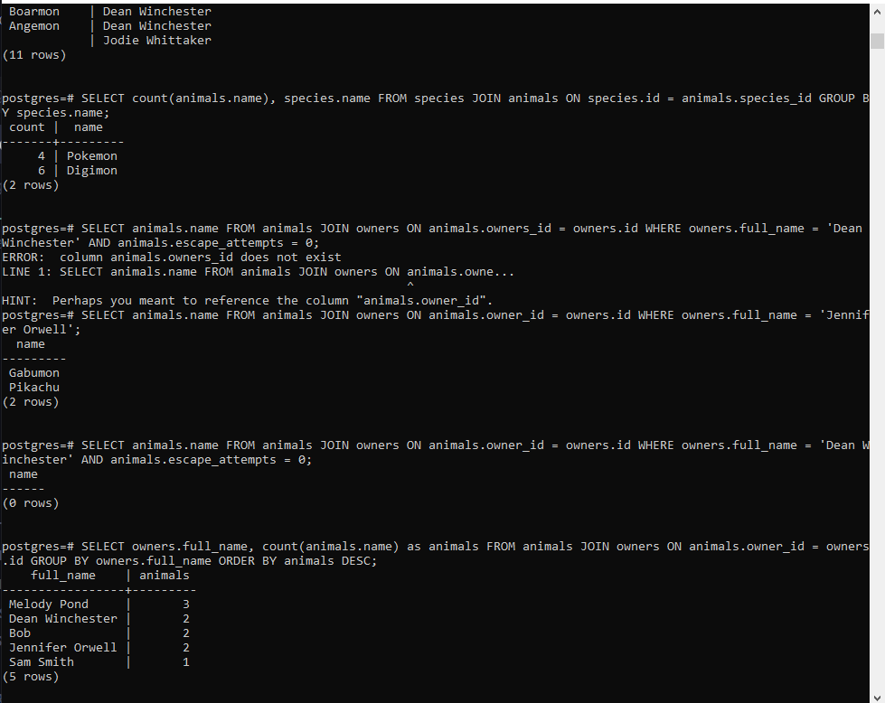

## the insert commands 

  

## the scheme section

  

## Final result of the inserted commands

  

## Result of the request queries are the tables according to the other been asked.

  

  

  

